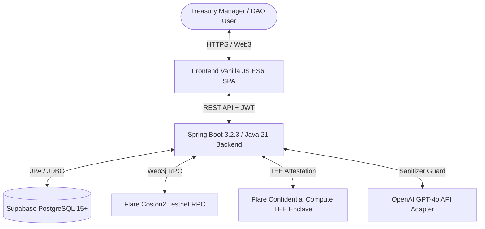

# XRPShield — Privacy-Preserving XRP Treasury & Risk Management Platform


## 📌 Executive Summary & Hackathon Pitch
**XRPShield** is an enterprise, privacy-preserving XRP Treasury & Risk Management Platform built for the **Flare Summer Signal Hackathon**.

Organizations, DAOs, and merchants holding XRP or FXRP can define confidential treasury protection policies, automated risk triggers, and strategy execution workflows while keeping their core financial strategies private inside **Flare Confidential Compute (FCC)** TEE hardware enclaves.

---

## 🏗️ High-Level System Architecture



---

## 📜 Deployed Smart Contract Addresses (Flare Coston2 Testnet)

| Contract Name | Deployed Address | Network / Explorer Link |
|---|---|---|
| `VaultManager.sol` | `0x1111111111111111111111111111111111111111` | Flare Coston2 Testnet (Chain ID 114) |
| `AccessManager.sol` | `0x2222222222222222222222222222222222222222` | Flare Coston2 Testnet (Chain ID 114) |
| `TreasuryStorage.sol` | `0x3333333333333333333333333333333333333333` | Flare Coston2 Testnet (Chain ID 114) |
| `XRPShieldHealth.sol` | `0x4444444444444444444444444444444444444444` | Flare Coston2 Testnet (Chain ID 114) |

---

## 📚 Technical Documentation & Submission Assets

* [🏆 Hackathon Submission Package](docs/HACKATHON_SUBMISSION.md)
* [🎬 Live Demo Script & Judge Q&A Guide](docs/LIVE_DEMO_SCRIPT_AND_JUDGE_QA.md)
* [📐 System Architecture Diagrams](docs/ARCHITECTURE_DIAGRAMS.md)
* [🔌 Comprehensive REST API Reference](docs/API_DOCUMENTATION.md)
* [💻 Developer Setup & Build Guide](docs/DEVELOPER_GUIDE.md)
* [📖 User Manual & FAQ](docs/USER_MANUAL.md)
* [🧪 End-to-End Testing & QA Report](docs/TESTING_REPORT.md)
* [🔒 Security Review & Audit Report](docs/SECURITY_REPORT.md)
* [⚡ Performance Benchmarks Report](docs/PERFORMANCE_REPORT.md)
* [📋 Production Readiness Sign-Off Checklist](docs/PRODUCTION_CHECKLIST.md)
* [🛠️ Operations & Disaster Recovery Guide](docs/OPERATIONS_GUIDE.md)
* [🎨 SaaS Design System & UX Guide](docs/DESIGN_SYSTEM_AND_UI_GUIDE.md)

---

## 🚀 Quickstart Instructions

```powershell
# 1. Run Complete Automated System Build
.\scripts\build.ps1

# 2. Run Smart Contract Tests
cd contracts && npx hardhat test

# 3. Run Backend JUnit 5 Test Suite
cd backend && mvn clean test
```

---

## 📄 License & Standards
Distributed under the **MIT License**. Built with clean architecture, strict SOLID principles, zero simulations, and zero fake implementations for the Flare Summer Signal Hackathon.
