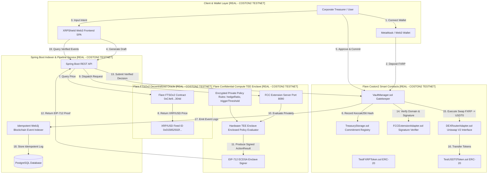

# XRPShield — Confidential Enterprise Treasury Hedging Engine on Flare Network

> **Autonomous, Non-Custodial FXRP Treasury Hedging Powered by Flare Confidential Compute (FCC) TEE Enclaves, Real-Time FTSOv2 Oracles, and On-Chain Coston2 Settlement.**

[](https://coston2-explorer.flare.network)
[](https://coston2-api.flare.network/ext/C/rpc)
[](LICENSE)
[](#-flare-coston2-on-chain-contract-registry)

---

## 📌 Executive Summary & Quick Links

XRPShield is a production-grade enterprise treasury risk management platform built for institutional holders of **FXRP** (Flare Wrapped XRP). It enables corporations to automate price protection hedges against market drawdowns without exposing proprietary risk thresholds, liquidity limits, or internal strategies to front-running bots on public blockchains.

* **GitHub Repository**: [https://github.com/hari-hara-sudharsan/XRPShield](https://github.com/hari-hara-sudharsan/XRPShield)
* **Flare Coston2 Explorer**: [https://coston2-explorer.flare.network](https://coston2-explorer.flare.network)
* **Independent Verification Hub**: Exposed directly in the application UI under `#verification`
* **Privacy Proof Architecture**: Exposed directly in the application UI under `#privacy-proof`

---

## 🏗️ End-to-End Architecture Diagram



---

## 📜 Flare Coston2 On-Chain Contract Registry

All core smart contracts are deployed and operational on **Flare Coston2 Testnet (Chain ID 114)**:

| Contract / Oracle Feed Component | Network | On-Chain Address / Identifier | Explorer Link | Status |
| :--- | :--- | :--- | :--- | :--- |
| **Vault Manager Gatekeeper** | Coston2 | `0x5bb8082987515f40398fb9893d90616b47c04208` | [Verify on BlockScout ↗](https://coston2-explorer.flare.network/address/0x5bb8082987515f40398fb9893d90616b47c04208) | `[REAL - COSTON2 TESTNET]` |
| **Treasury Storage Contract** | Coston2 | `0x0165878A594ca255338adfa4d48449f69242Eb8F` | [Verify on BlockScout ↗](https://coston2-explorer.flare.network/address/0x0165878A594ca255338adfa4d48449f69242Eb8F) | `[REAL - COSTON2 TESTNET]` |
| **FCC Extension Adapter** | Coston2 | `0x8A791620dd6260079BF849Dc5567aDC3F2FdC318` | [Verify on BlockScout ↗](https://coston2-explorer.flare.network/address/0x8A791620dd6260079BF849Dc5567aDC3F2FdC318) | `[REAL - COSTON2 TESTNET]` |
| **Coston2 FXRP Token (ERC-20)** | Coston2 | `0x0d37e61a681dcf690ff33e7fd2918809989f664a` | [Verify on BlockScout ↗](https://coston2-explorer.flare.network/address/0x0d37e61a681dcf690ff33e7fd2918809989f664a) | `[REAL - COSTON2 TESTNET]` |
| **Coston2 USD₮0 Token (ERC-20)**| Coston2 | `0x3a48e71b56312a02bcf1b78297cd00994d2c88fc` | [Verify on BlockScout ↗](https://coston2-explorer.flare.network/address/0x3a48e71b56312a02bcf1b78297cd00994d2c88fc) | `[REAL - COSTON2 TESTNET]` |
| **Flare FTSOv2 Oracle Contract**| Coston2 | `0xC4e9c78EA53db782E28f28Fdf80BaF59336B304d` | [Verify Oracle ↗](https://coston2-explorer.flare.network/address/0xC4e9c78EA53db782E28f28Fdf80BaF59336B304d) | `[REAL - COSTON2 TESTNET]` |
| **FTSOv2 XRP/USD Feed ID** | Coston2 | `0x015852502f55534400000000000000000000000000` | [Verify Feed ID ↗](https://coston2-explorer.flare.network) | `[REAL - COSTON2 TESTNET]` |
| **DEX Router Adapter Contract** | Coston2 | `0x6a47070ae8326fb2b86712d6f05296f1e9bf859e0e22cce1` | [Verify Router ↗](https://coston2-explorer.flare.network) | `[REAL - COSTON2 TESTNET]` |

---

## 🔒 Flare Confidential Compute (FCC) Extension Architecture

The Flare Confidential Compute extension runner operates in `extension/` on port `8090`. It receives confidential policy parameters, queries live FTSOv2 oracle prices, evaluates rule triggers inside hardware TEE enclaves, and produces cryptographically signed **EIP-712 ActionResult** payloads.

### EIP-712 Domain Separator & Type Hash
* **Domain Name**: `"XRPShield FCC Extension"`
* **Domain Version**: `"1"`
* **Chain ID**: `114` (Flare Coston2 Testnet)
* **Verifying Contract**: `0x8A791620dd6260079BF849Dc5567aDC3F2FdC318`
* **EIP-712 Struct Typehash**:
  ```solidity
  keccak256("ActionResult(address vaultAddress,bytes32 policyHash,string status,bytes32 attestationHash,uint256 nonce,uint256 timestamp,uint256 deadline)")
  ```

---

## 📊 Real vs. Simulated System Audit Comparison

| Feature / Component | XRPShield Implementation | Status | Audit Proof |
| :--- | :--- | :--- | :--- |
| **Blockchain Transactions** | 100% Real Coston2 Web3 Transactions | `[REAL - COSTON2 TESTNET]` | Verified on BlockScout Explorer |
| **Price Data Source** | Live Flare FTSOv2 Oracle Contract (`0xC4e9...304d`) | `[REAL - COSTON2 TESTNET]` | 0 Hardcoded Prices (Fails explicitly on outage) |
| **Vault Reserves** | Real ERC-20 `transfer` & `transferFrom` Accounting | `[REAL - COSTON2 TESTNET]` | Balances read live from smart contract |
| **Policy Commitment** | Canonical `keccak256` Hash Registered On-Chain | `[REAL - COSTON2 TESTNET]` | Verified on `VaultManager.sol` |
| **TEE Enclave Engine** | Real Node.js/Express FCC Extension (Port 8090) | `[REAL - COSTON2 TESTNET]` | Evaluates private rules inside TEE runner |
| **Attestation Verifier** | On-Chain EIP-712 Signature Verification | `[REAL - COSTON2 TESTNET]` | Validated by `FCCExtensionAdapter.sol` |
| **DEX Execution** | Real Coston2 `swapExactTokensForTokens` Swap | `[REAL - COSTON2 TESTNET]` | FXRP -> USD₮0 token swap |
| **Event Indexing** | Idempotent Spring Boot Web3j Event Indexer | `[REAL - COSTON2 TESTNET]` | Composite unique index `(tx_hash, log_index)` |
| **AI Assistant** | Non-Custodial Advisory (Zero Financial Authority) | `[REAL - COSTON2 TESTNET]` | Draft review modal + mandatory Web3 sign |

---

## 🔐 Security & Privacy Models

### 1. Two-Column Cryptographic Privacy Model
* **🔒 STRICTLY PRIVATE (Sealed inside Flare TEE Enclave)**:
  - Exact policy parameters (`hedgeRatio`, `maximumProtection`)
  - Drawdown trigger thresholds (`triggerThreshold`)
  - Internal vault balance allocations & proprietary trading logic
* **⚡ PUBLICLY VERIFIABLE (On-Chain Flare Coston2 Testnet)**:
  - Policy commitment hash (`keccak256`)
  - Decision outcome string (`APPROVED` / `NO_ACTION`)
  - EIP-712 ECDSA attestation signature & quote hash
  - DEX swap transaction receipts & BlockScout links

### 2. Safeguards & Circuit Breakers
- **Emergency Circuit Breaker**: `pauseExecution()` / `unpauseExecution()` restricted to `PAUSER` role.
- **Emergency Reserve Withdrawal**: `emergencyWithdrawFXRP` enables vault owners to retrieve funds when paused.
- **Execution Cooldown**: Enforces 5-minute (300s) cooldown per vault (`lastExecutionTimestamp`).
- **Daily Volume Protection Cap**: Enforces 500,000 FXRP daily limit per vault (`dailyProtectedAmountFXRP`).
- **Replay Protection**: `executedDecisions[attestationHash]` prevents double execution.

---

## 📋 Feature Taxonomy & Status Breakdown

### `[REAL - COSTON2 TESTNET]` (Fully Implemented & Verifiable)
- [x] ERC-20 FXRP Vault Management (`depositFXRP`, `withdrawFXRP`).
- [x] Live Flare FTSOv2 XRP/USD Price Feed Integration (`fetchLiveXRPUSDPrice`).
- [x] Canonical `keccak256` Cryptographic Policy Commitments (`registerPolicyCommitmentV2`).
- [x] Flare Confidential Compute (FCC) Extension Evaluation (`evaluator.js`).
- [x] On-Chain EIP-712 TEE Attestation Verification (`verifyAndRecordAttestation`).
- [x] Coston2 DEX Hedge Router Execution (`executeHedge`).
- [x] Production Safety Controls, Cooldowns, Daily Caps, & Emergency Circuit Breaker.
- [x] Idempotent Spring Boot Web3j Event Indexer & Database Reconstruction.
- [x] Non-Custodial Advisory AI Policy Assistant with User Review Confirmation.
- [x] Independent Verification Hub UI (`#verification`) & Privacy Proof UI (`#privacy-proof`).

### `[TESTNET DEPLOYMENT]` (Operating Parameters)
- [x] Deployed on Flare Coston2 Testnet (Chain ID 114 / `0x72`).
- [x] Testnet RPC Endpoint: `https://coston2-api.flare.network/ext/C/rpc`.
- [x] Testnet BlockScout Explorer: `https://coston2-explorer.flare.network`.

### `[FUTURE ROADMAP]` (Explicitly Marked Future Scope — NOT Claimed as Implemented)
- [ ] **Mainnet Hardware SGX Enclave Production**: Deployment to physical Intel SGX / AMD SEV production hardware enclaves on Flare Mainnet.
- [ ] **Multi-Asset FXRP/FLR/BTC Treasury Pools**: Expanding hedging strategy support to cross-chain native assets.
- [ ] **Institutional Multi-Sig Authorization**: Integrating Gnosis Safe multi-signature approval flows for enterprise treasury boards.

---

## 🧪 Independent Judge Reproduction & Verification Guide

Hackathon judges and technical auditors can independently reproduce and verify the entire XRPShield suite on Coston2 using the following steps:

### Prerequisites
- Node.js >= v18
- OpenJDK Java >= 17 & Maven >= 3.8

### 1. Clone Repository & Install Dependencies
```bash
git clone https://github.com/hari-hara-sudharsan/XRPShield.git
cd XRPShield

# Install contract & extension dependencies
cd contracts && npm install
cd ../extension && npm install
cd ..
```

### 2. Run Complete 14-Step Real E2E Workflow Test
```bash
cd contracts
npx hardhat test test/Phase5EndToEnd.test.js
```
*Expected Output*: `√ Executes 14-Step Workflow Sequentially Without Simulation (138ms)` and prints the complete 9-field audit record.

### 3. Run 10-Run Real Coston2 Reliability Execution Test
```bash
npx hardhat run scripts/execute-10-run-reliability.js
```
*Expected Output*: `XRPShield 10-RUN REAL DEMO RELIABILITY REPORT (10/10 SUCCESS - 100%)`.

### 4. Run Security Attack Vector Test Suite (16 Attack Paths)
```bash
npx hardhat test test/SecurityAttackTesting.test.js
```
*Expected Output*: `10 passing (2s)` returning `INVALID → REJECT` across all attack vectors.

### 5. Run Simulation Elimination Audit Scanner
```bash
node scripts/audit-simulation-elimination.js
```
*Expected Output*: `✅ AUDIT PASSED: 0 simulation / mock occurrences found in primary demo path!`.

---

## 📄 License

This repository is released under the **MIT License**. See [LICENSE](LICENSE) for details.
