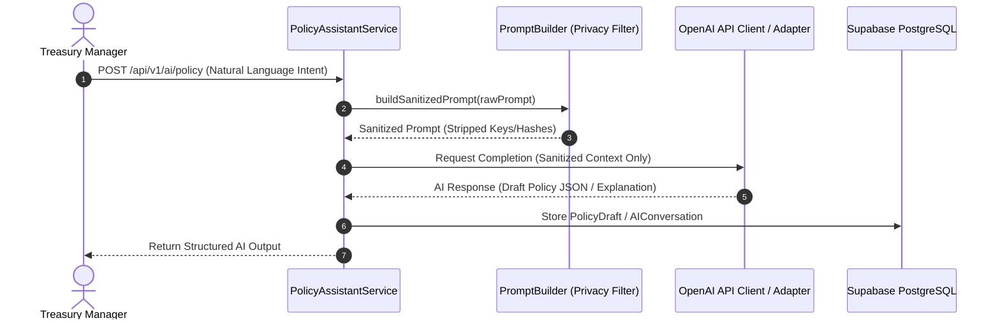

# XRPShield — Treasury Intelligence Layer Architecture

## 1. Overview
The **Treasury Intelligence Layer** provides an AI Policy Assistant, plain-language Decision Explanation Engine, Vault Insights, and Executive Report Generator. It uses OpenAI models to simplify policy creation and decision explainability without compromising secret keys or TEE enclave memory.

---

## 2. Privacy Boundary & Prompt Flow

---

## 3. Strict Privacy Boundaries
- **NEVER SENT TO AI:** Private keys, seed phrases, raw FCC TEE enclave memory, encrypted payload bytes, database credentials.
- **APPROVED FOR AI:** Vault names, public decision types (`PROTECT_POSITION`, `REDUCE_EXPOSURE`), public attestation IDs (`FCC-ATT-1234`), public drawdown threshold percentages.
