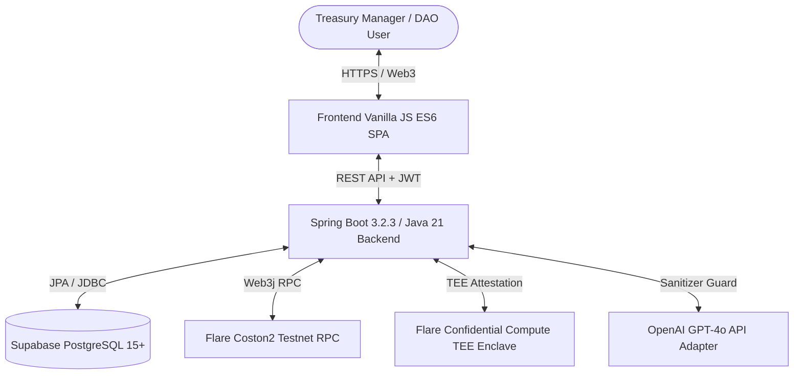
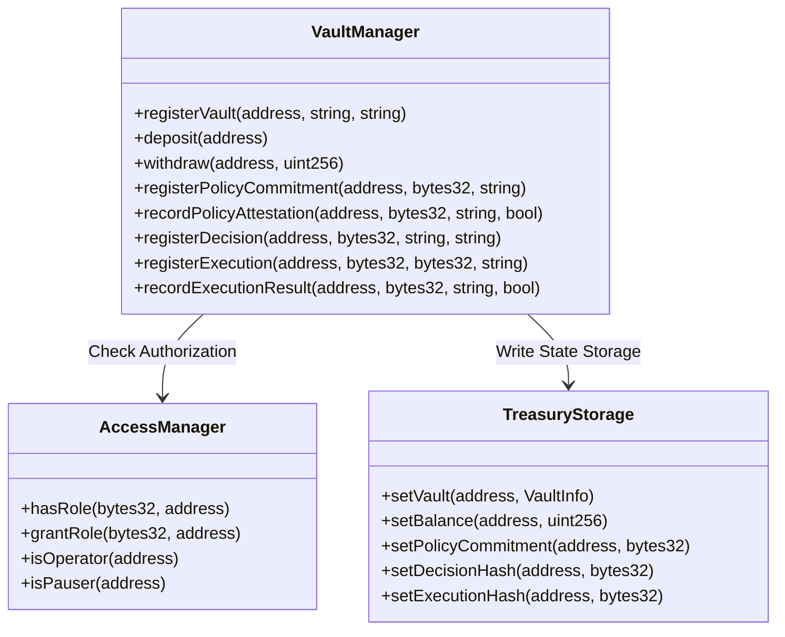
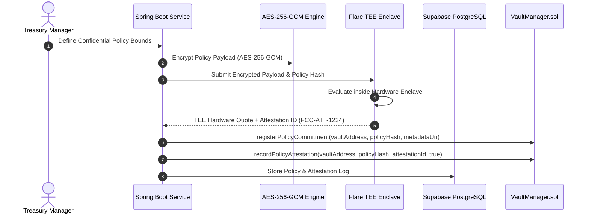
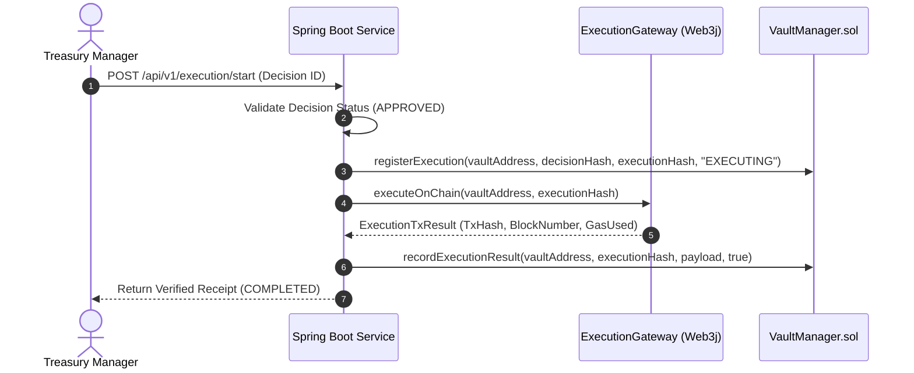

# XRPShield — Production Architecture Diagrams

## 1. Overall System Architecture

---

## 2. Smart Contract Layout (`contracts/contracts/`)

---

## 3. Flare Confidential Compute (FCC) TEE Evaluation Flow

---

## 4. Protected Treasury Execution Engine Flow

