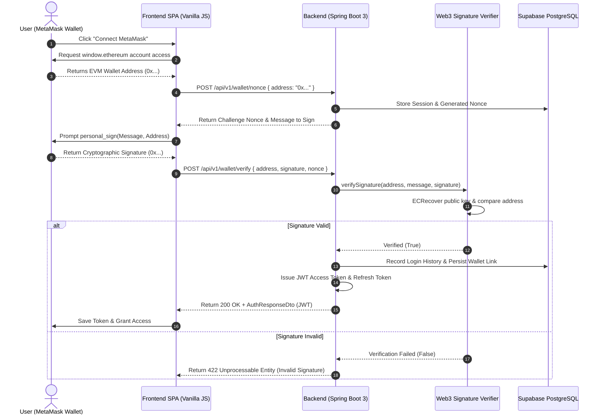
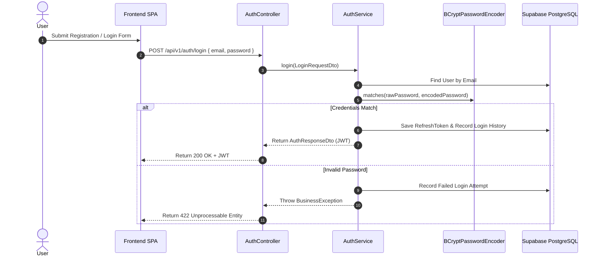

# XRPShield — Authentication & Identity Architecture

## 1. Overview
XRPShield supports dual production authentication methods:
1. **Web3 Cryptographic Signature Authentication (EIP-191 / EIP-4361):** Users sign a server-generated challenge nonce using their MetaMask EVM wallet (`personal_sign`). The backend recovers the public address using Web3j ECRecover and issues a signed JWT token pair.
2. **Password Authentication:** Standard email/password registration with BCrypt password hashing ($2a$10 strength) and role-based authorization.

---

## 2. Web3 MetaMask Wallet Signature Flow Diagram

---

## 3. Password Authentication Flow Diagram

