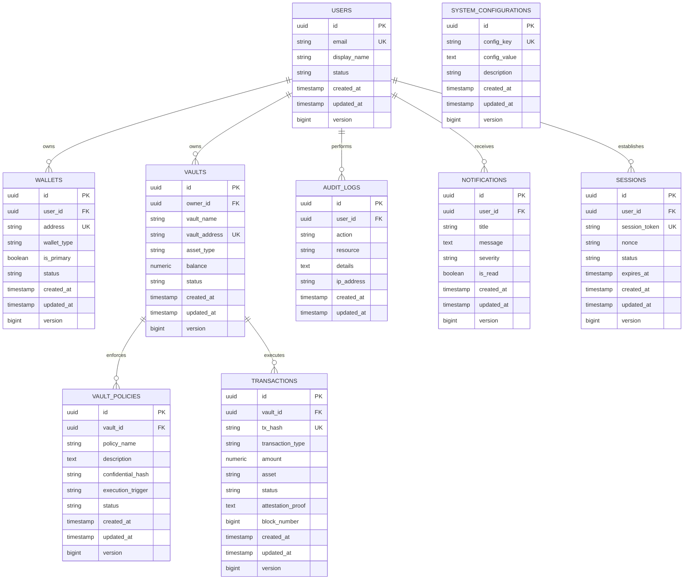

# XRPShield — Database Documentation & ER Diagram

## 1. Overview
The XRPShield persistent storage layer is built on **Supabase PostgreSQL 15+**. It features a normalized relational schema, strict foreign key constraints, UUID primary keys, default timestamps (`created_at`, `updated_at`), performance indexing, and `@Version` optimistic locking columns across all major domain entities.

---

## 2. Production Entity Relationship (ER) Diagram

---

## 3. Table Definitions & Relationships

| Table Name | Description | Primary Key | Foreign Keys | Key Indexes |
| :--- | :--- | :--- | :--- | :--- |
| `users` | User identity records | `id` (UUID) | None | `email`, `status` |
| `wallets` | Web3 EVM & XRP addresses | `id` (UUID) | `user_id` $\rightarrow$ `users(id)` | `user_id`, `address` |
| `vaults` | Confidential FXRP treasury vaults | `id` (UUID) | `owner_id` $\rightarrow$ `users(id)` | `owner_id`, `status` |
| `vault_policies` | TEE confidential policy rules | `id` (UUID) | `vault_id` $\rightarrow$ `vaults(id)` | `vault_id`, `status` |
| `transactions` | Treasury ledger & attestations | `id` (UUID) | `vault_id` $\rightarrow$ `vaults(id)` | `vault_id`, `tx_hash`, `status` |
| `audit_logs` | Security audit trail | `id` (UUID) | `user_id` $\rightarrow$ `users(id)` | `user_id`, `action` |
| `notifications` | System & user alert messages | `id` (UUID) | `user_id` $\rightarrow$ `users(id)` | `user_id`, `is_read` |
| `sessions` | Active Web3 authentication nonces | `id` (UUID) | `user_id` $\rightarrow$ `users(id)` | `user_id`, `session_token` |
| `system_configurations` | Global configuration settings | `id` (UUID) | None | `config_key` |

---

## 4. Indexing Strategy & Performance
- **Primary Indexes:** B-tree indexes generated automatically on standard UUID primary keys.
- **Unique Indexes:** High-cardinality unique constraints on `email`, `address`, `vault_address`, `tx_hash`, `session_token`, and `config_key`.
- **Foreign Key Search Indexes:** Indexed `user_id`, `owner_id`, and `vault_id` columns to guarantee high-performance relational joins without full table scans.
