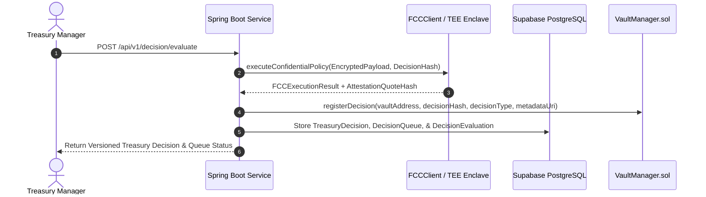

# XRPShield — Treasury Decision Engine Architecture

## 1. Overview
The **Treasury Decision Engine** evaluates confidential risk policies against real-time vault states inside **Flare Confidential Compute (FCC)** TEE enclaves. It generates versioned, cryptographically-signed treasury decisions (`NO_ACTION`, `PROTECT_POSITION`, `REDUCE_EXPOSURE`, `INCREASE_PROTECTION`, `REQUEST_REVIEW`, `EMERGENCY_EXIT`) without trade execution.

---

## 2. Decision Generation Sequence Diagram

---

## 3. Supported Decision Types & Lifecycle
- `NO_ACTION`: Vault risk parameters within optimal bounds.
- `PROTECT_POSITION`: Recommends position protection or collateralization.
- `REDUCE_EXPOSURE`: Suggests exposure reduction due to risk threshold proximity.
- `INCREASE_PROTECTION`: Elevates vault protection status.
- `REQUEST_REVIEW`: Requests manual treasury manager intervention.
- `EMERGENCY_EXIT`: Triggers emergency freeze state.

### Lifecycle Statuses
`PENDING` -> `APPROVED` / `REJECTED` -> `EXPIRED`
