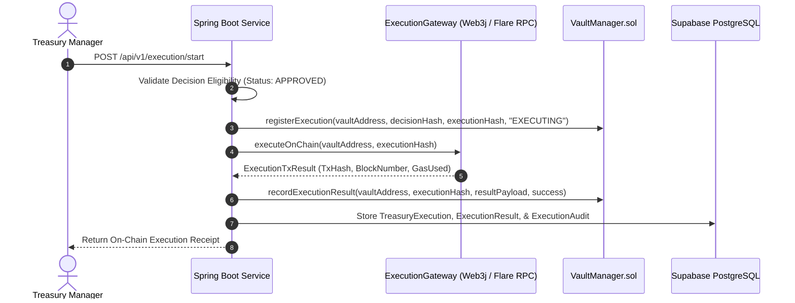

# XRPShield — Protected Treasury Execution Engine Architecture

## 1. Overview
The **Protected Treasury Execution Engine** ensures that only **APPROVED** confidential policy decisions evaluated inside Flare TEE enclaves can transition to on-chain execution on the **Flare Network**.

---

## 2. Protected Execution Sequence Diagram



---

## 3. Execution State Machine

```
   [PENDING]
      │
      ▼
   [QUEUED] ──────► [CANCELLED]
      │
      ▼
 [VALIDATING]
      │
      ▼
  [EXECUTING]
   ┌──┴────────┐
   ▼           ▼
[COMPLETED] [FAILED] (Retry Policy: max 3 attempts)
```

---

## 4. Recovery & Retry Strategy
1. **Idempotency:** Each execution produces a unique `execution_hash`. Multiple duplicate submissions return the original receipt.
2. **Retry Policy:** `ExecutionScheduler` retries failed queue items up to `max_retries = 3` before marking state as `FAILED`.
3. **Audit Trail:** All state transitions and transaction hashes are logged into `execution_audits`.
