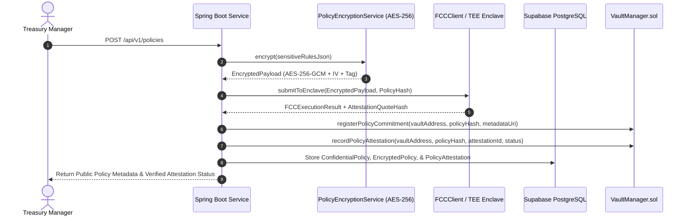

# Flare Confidential Compute (FCC) Integration Architecture

## 1. Overview
**Flare Confidential Compute (FCC)** allows XRPShield to evaluate confidential treasury policies inside Trusted Execution Environments (TEEs) without revealing sensitive parameters (risk thresholds, stop loss values, drawdown limits) to public nodes or third parties.

---

## 2. Enclave Execution Sequence Diagram

---

## 3. TEE Attestation Verification Flow
1. **Quote Generation:** The TEE enclave generates an attestation quote hash (`enclave_quote_hash`) signed by the hardware root of trust.
2. **Backend Validation:** `AttestationService` receives the quote and validates the enclave signature.
3. **On-Chain Recording:** `VaultManager.sol` emits `PolicyAttestationRecorded` for public verifiability on Flare Network.
