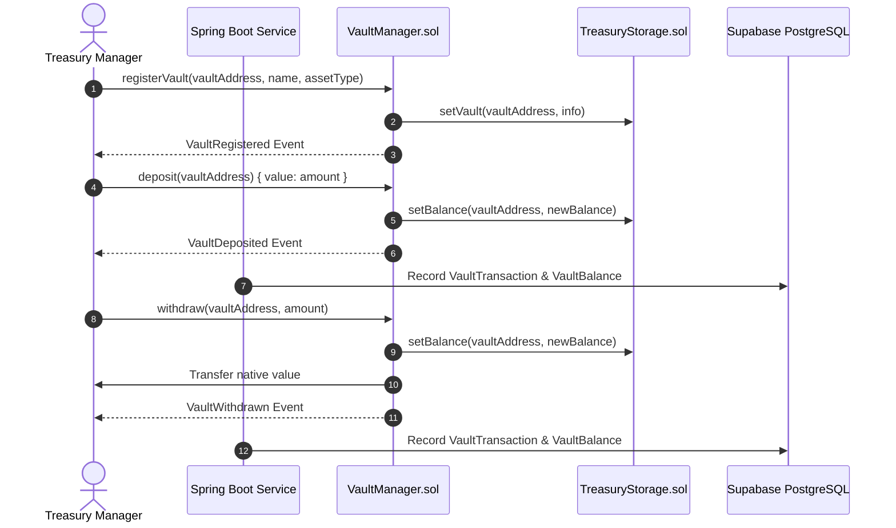

# XRPShield — Confidential Treasury Vault Architecture

## 1. Overview
The **XRPShield Treasury Vault Infrastructure** provides production-grade asset custody, balance accounting, FXRP deposits, and withdrawals on the **Flare Network**.

---

## 2. Vault Lifecycle & Contract Flow

---

## 3. Database Schema Reference (V6)
- **`vaults`:** Stores metadata, owner user ID, contract address, strategy name.
- **`vault_balances`:** Real-time balance tracking per currency (`FXRP`, `XRP`).
- **`vault_transactions`:** On-chain deposit & withdrawal ledger (`tx_hash`, `amount`, `status`).
- **`vault_history`:** Audit activity trail.

---

## 4. REST API Specification

| Endpoint | Method | Description |
| :--- | :--- | :--- |
| `/api/v1/vault` | `POST` | Create a new confidential treasury vault |
| `/api/v1/vault` | `GET` | List user's active treasury vaults |
| `/api/v1/vault/{id}` | `GET` | Get detailed vault metadata and FXRP balance |
| `/api/v1/vault/deposit` | `POST` | Process FXRP deposit transaction into vault |
| `/api/v1/vault/withdraw` | `POST` | Process FXRP withdrawal transaction from vault |
| `/api/v1/vault/history` | `GET` | Retrieve vault transaction and deposit history |
